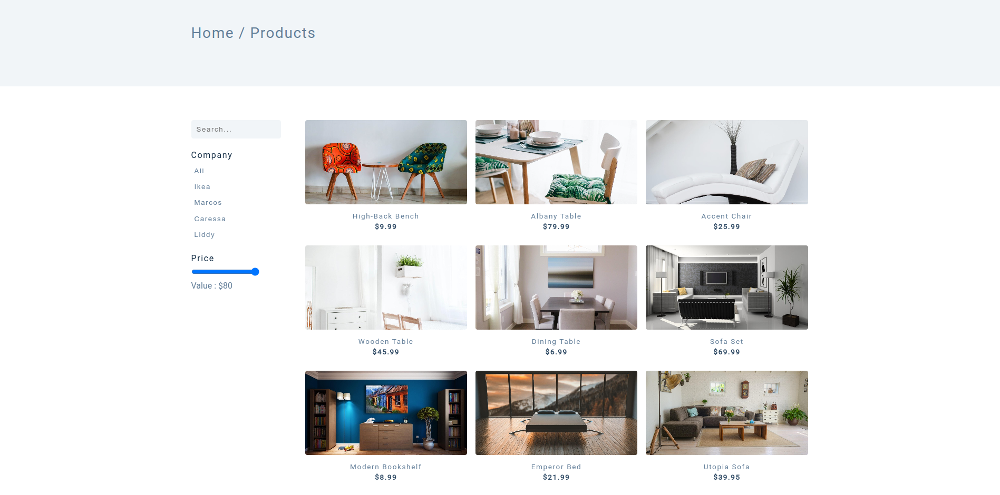
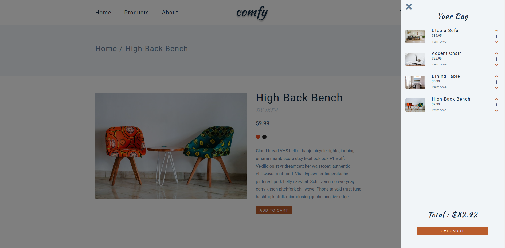

# Comfy Store

<div id="top"></div>


<!-- PROJECT LOGO -->
<div align="center">
  <br>
  <a href="https://comfy-store-js.vercel.app/">
      
    </a>
  <br>
  <br>

  <p align="center">
  <a href="https://comfy-store-js.vercel.app/">View Demo</a>
    ·
    <a href="https://github.com/abdrahmansoltan/Comfy-Store-JS/issues">Report Bug</a>
  </p>
</div>

<!-- TABLE OF CONTENTS -->
<details>
  <summary>Table of Contents</summary>
  <ol>
    <li>
      <a href="#about-the-project">About The Project</a>
      <ul>
        <li><a href="#features">Features</a></li>
      </ul>
    </li>
    <li>
      <a href="#getting-started">Getting Started</a>
      <ul>
        <li><a href="#installation">Installation</a></li>
        <li><a href="#api-endpoints">API EndPoints</a></li>
      </ul>
    </li>
    <li><a href="#contributing">Contributing</a></li>
  </ol>
</details>

<!-- ABOUT THE PROJECT -->

## About The Project

E-commerce App created with Vanilla Javascript





### Features

- Browse fetched products
- add/remove product to cart
- persist data in localstorage

<p align="right">(<a href="#top">back to top</a>)</p>

---

## Getting Started

This project require some perquisites and dependencies to be installed, you can view it online using this [demo](https://comfy-store-js.vercel.app/). or you can find the instructions below:

> To get a local copy, follow these simple steps :

### Installation

1. Clone the repo

   ```sh
   git clone https://github.com/abdrahmansoltan/Dad-Jokes.git
   ```

2. go to project folder

   ```sh
   cd Comfy-Store-JS
   ```

3. Run development server

   - using [Live Server](https://marketplace.visualstudio.com/items?itemName=ritwickdey.LiveServer) extension
   - using Package Manager

     ```sh
     npm init
     npm i live-server
     npm run live-server --open=./index.html
     ```

<p align="right">(<a href="#top">back to top</a>)</p>

---

### API EndPoints

- Products: [https://course-api.com/javascript-store-products](https://course-api.com/javascript-store-products) [GET]
- Single Product: [https://course-api.com/javascript-store-single-product?id=PRODUCT_ID](https://course-api.com/javascript-store-single-product?id=PRODUCT_ID) [GET]

<p align="right">(<a href="#top">back to top</a>)</p>

---

<!-- CONTRIBUTING -->

## Contributing

Contributions are what make the open source community such an amazing place to learn, inspire, and create. Any contributions you make are **greatly appreciated**.

If you have a suggestion that would make this better, please fork the repo and create a pull request. You can also simply open an issue with the tag "enhancement".
Don't forget to give the project a star! Thanks again!

1. Fork the Project
2. Create your Feature Branch (`git checkout -b feature/AmazingFeature`)
3. Commit your Changes (`git commit -m 'Add some AmazingFeature'`)
4. Push to the Branch (`git push origin feature/AmazingFeature`)
5. Open a Pull Request

<p align="right">(<a href="#top">back to top</a>)</p>
